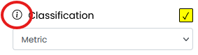
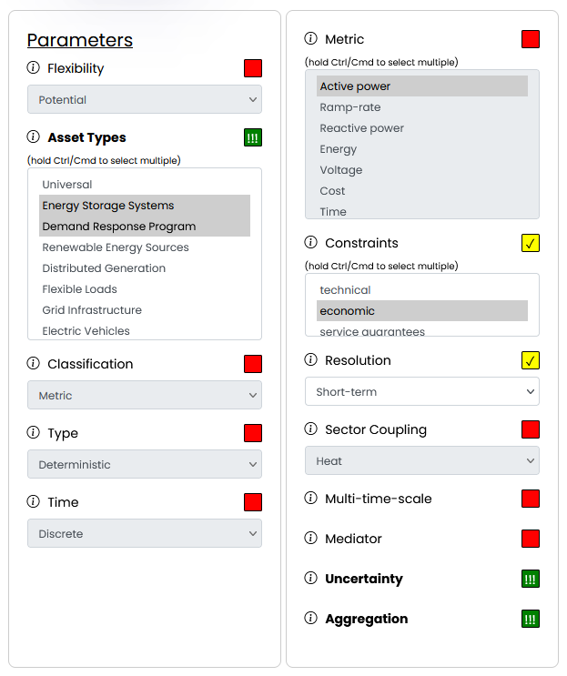
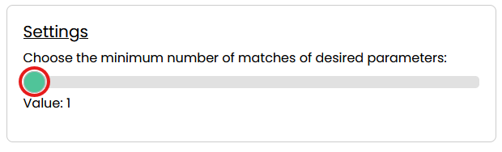
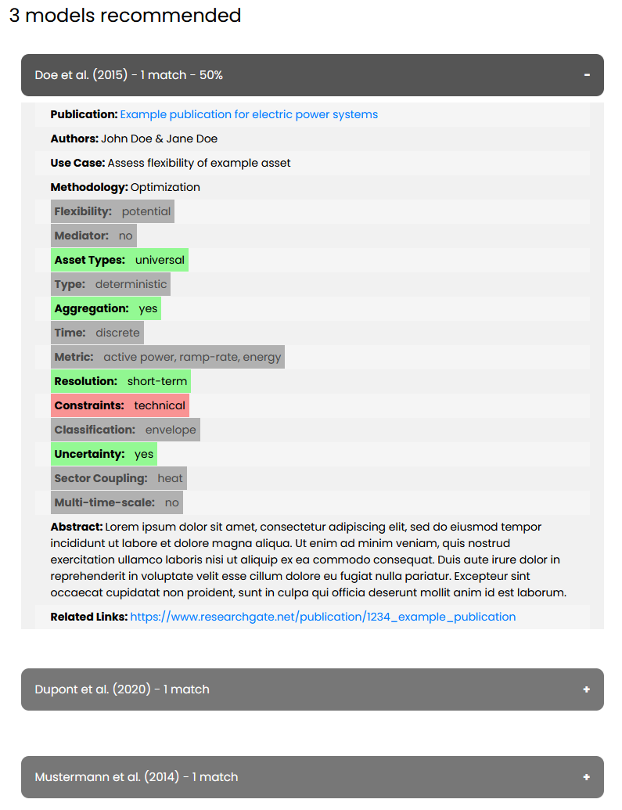

# Tutorial on flexibility modeling
Flexibility modeling in Cyber-Physical Energy Systems (CPES) is essential for addressing various use cases, such as managing uncertainty and variable generation, and is key to optimizing the utilization of energy resources. Each use case comes with its own set of requirements, making it essential to first gain an overview of these requirements in order to identify or develop the most suitable model for a specific scenario.

This tutorial deals with typical steps to proceed when dealing with flexibility modeling. Instead of describing a detailed application of one specific flexibility model, we aim to provide a tutorial that can be used for any kind of flexibility model and that helps users find or develop a suitable model regarding their needs.
We assume that the user tries to find a suitable model for flexibility, either modeling its own or using existing models.

This tutorial therefore helps to identify the most relevant parameters of a flexibility model, to specify the requirements of the flexibility model, and to categorize it accordingly. Once this is done, and the model can be described in detail, we provide a recommender to help find a suitable existing model. To reduce effort and increase effectiveness, it is recommended to search for existing models before implementing your own. Many models already exist. For this reason, it is better to search for an existing model and make an adjustment instead of implementing your own model. However, if no suitable model exists, the user is ready to implement his own model because he has categorized it accordingly.
The tutorial is structured as follows. First, we present the relevant parameters, each with their respective categories. Afterwards, is it discussed how the suitable flexibility model can be identified. In the last part, we discuss how to work with the respective model.

# Using the Flexibility Model Recommender: A Step-by-Step Guide
To demonstrate how to use the **[Flexibility Model Recommender](https://flexibility.offis.de/)**, we will walk through a sample scenario step by step. This example illustrates the selection process and filtering workflow, making it easier to understand how the tool helps identify suitable flexibility models based on specific needs.

## Example scenario
A **Virtual Power Plant (VPP)** aggregates multiple small-scale flexibility resources (such as residential batteries and industrial demand response participants) to enhance grid stability while managing uncertainties in renewable energy generation.

## Step 1: Exploring Parameter Options
Before selecting parameters, we familiarize ourselves with the available choices:

- The [Parameter Explanation article on the Help page](https://flexibility.offis.de/help.php#help-parameters) provides an overview.
- Alternatively, clicking the information icon next to each parameter within the Flexibility Model Recommender opens a popover with a description.

## Step 2: Selecting Parameters for the Scenario
Next, we navigate to the [Flexibility Model Recommender](https://flexibility.offis.de/recommender.php) and define our selection:

Using the **three-way checkboxes** next to each parameter, we categorize them as mandatory, desired, or irrelevant for our VPP scenario.

### Mandatory Parameters (Strictly Required)
1. **Demand Response Programs** (Asset Type) → The VPP includes demand-side participants that adjust consumption based on market signals.
2. **Energy Storage Systems** (Asset Type) → Distributed batteries are used to store excess energy and discharge it when needed.
3. **Uncertainty** → The VPP must handle fluctuations in renewable generation and demand variations.
4. **Aggregation** → The model must support grouping multiple smaller flexibility resources into a unified entity.

### Desired Parameters (Preferred but not mandatory)
5. **Short-term Resolution** → The VPP operates in real-time and short time frames, so models with short-term decision-making are beneficial.
6. **Economic Constraints** → The VPP aims to optimize financial outcomes but does not make it an absolute requirement.

### Irrelevant Parameters (Not considered)
- **Other parameters** are not relevant to this example.

At this point, the parameter selection should match the intended scenario.

## Step 3: Adjusting Match Requirements
We now define the **minimum number of desired parameters** a flexibility model must meet.

- In this example, we set the value to 1, meaning at least one of our desired parameters must be present.
- Setting this value to 2 would require both desired parameters to be included, effectively making them mandatory.

## Step 4: Retrieving Matching Models
Finally, we click the **"Show Models" button**, and the recommender generates a list of flexibility models that best match our selected parameters, displaying the most relevant options first.

Clicking on any model in the results expands it to reveal more details.

**Example of a possible result:**

## Conclusion
By following this process, you can efficiently use the Flexibility Model Recommender to identify models that best suit your specific needs, ensuring a streamlined selection process for various flexibility scenarios.

For a comprehensive overview of all available models and their details, navigate to the [Models tab](https://flexibility.offis.de/models.php).

# Parameter Explanation
In the following, we describe various parameters to categorize flexibility models.
It is recommended to get an overview of the requirements of the flexibility model by answering the questions regarding the given categories. For some categories it might not be possible to have an answer at the beginning, however, we recommend trying to fill these requirements as detailed as possible in order to find a suitable flexibility model.

## Flexibility
Flexibility can be modeled as potential or as requirements.
- **Flexibility potential** represents the capability of flexibility resources (like energy storage, and demand response) to adjust their power output or
consumption, providing essential services like energy supply or demand balance.
- **Flexibility requirement** refers to the overall needs of the power system for flexible resources to maintain stable operations and adapt to variability,
such as that from renewable energy sources. This quantifies the adjustments necessary across the system to ensure reliability and prevent
disruptions.

## Asset Types
The type(s) of the considered assets.
- **Energy Storage Systems:** Such as batteries, pumped hydro storage, and compressed air energy storage, which can absorb excess power during low demand and release it during peak demand.
- **Demand Response Programs:** These involve adjusting the demand side of consumption, where consumers reduce or shift their electricity use in response to market signals or utility requests.
- **Renewable Energy Sources:** Like wind turbines and solar panels, which are inherently variable and require flexible solutions to integrate their output smoothly into the grid.
- **Distributed Generation:** Including small-scale units like diesel generators, microturbines, and combined heat and power (CHP) systems that can be controlled to help balance local demand and supply.
- **Flexible Loads:** Industrial processes, heating and cooling systems, and other energy-intensive operations that can be adjusted in real-time to help balance the grid.
- **Grid Infrastructure:** Advanced transmission technologies, including smart grids and dynamic line rating systems, that can adapt to changing conditions and manage flows more effectively.
- **Electric Vehicles (EVs):** Their charging and discharging can be managed to provide flexibility, particularly as the prevalence of EVs continues to increase.
- **Interconnectors:** High voltage lines connecting different regions or countries, allowing for the transfer of electricity across borders, which can be used to balance regional differences in demand and supply.
- **Peaking Power Plants:** Typically gas turbines or hydro plants can be ramped up quickly to meet sudden increases in electricity demand or unexpected drops in renewable generation.

## Classification
- **Metric:** Uses predefined parameters to either deterministically quantify flexibility without considering uncertainties or measure the likelihood of various flexibility scenarios using statistical methods.
- **Machine Learning Model:** Employs machine learning techniques to predict and optimize flexibility based on historical data.
- **Envelope:** Defines the operational boundaries or limits within which flexibility can be effectively measured or maintained. This includes the range of acceptable inputs, outputs, and constraints on flexibility metrics or predictions.

Some more details for the classification types are given in the following.

- **Time Series - Cumulative:** Analyzes flexibility over a period by aggregating data to show cumulative potential or requirements.
- **Time Series - Non-Cumulative:** Examines flexibility potentials or requirements at specific times without accumulating data over time.
- **Set - Interval:** Represents flexibility within set boundaries defined by minimum and maximum values at a specific time.
- **Set - Polytope - Single-Time-Step:** Defines flexibility as a geometric shape in a multidimensional space at a single time step, capturing constraints and capabilities.
- **Set - Polytope - Multi-Time-Step:** Extends the single-time-step polytope model to cover multiple time steps, providing a broader view of flexibility over time.

## Type
- **Deterministic:** Using specific, fixed parameters and conditions to calculate flexibility needs and potentials. These models operate under the assumption that all inputs (such as demand forecasts, generation capacity, and operational constraints) are known and remain constant, leading to predictable and consistent outcomes.
- **Probabilistic:** Accounting for the uncertainty inherent in energy systems by using probability distributions and stochastic processes to determine flexibility requirements and resources. These models consider variations in input data like renewable energy output, consumer demand, and equipment failures, providing a range of possible outcomes rather than a single deterministic result.

## Time
- **Discrete:** Using specific, fixed parameters and conditions to calculate flexibility needs and potentials. These models operate under the assumption that all inputs (such as demand forecasts, generation capacity, and operational constraints) are known and remain constant, leading to predictable and consistent outcomes.
- **Continuous:** Accounting for the uncertainty inherent in energy systems by using probability distributions and stochastic processes to determine flexibility requirements and resources. These models consider variations in input data like renewable energy output, consumer demand, and equipment failures, providing a range of possible outcomes rather than a single deterministic result.

## Metric
- **Active power:** The real component of power that performs actual work in an electrical system, typically measured in watts (W) or megawatts (MW).
- **Ramp-Rate:** The rate at which power output can be increased or decreased, usually measured in megawatts per minute (MW/min), indicating the flexibility of power generation or consumption.
- **Reactive power:** The imaginary component of power that does not perform work but is necessary to maintain voltage levels for the stability of the power system, usually measured in volt-amperes reactive (VAR).
- **Energy:** The total amount of work performed or electricity consumed over a period, typically measured in kilowatt-hours (kWh) or megawatt-hours (MWh).
- **Voltage:** The electric potential difference between two points in a circuit, which drives the current through the electrical system, typically measured in volts (V).

## Constraints
- **Technical:** Define the physical limits of power system components, such as maximum power output and ramp rates.
- **Service Guarantee:** Ensure that flexibility resources meet specific performance and reliability standards, such as response times and availability.
- **Economic:** Focus on minimizing operational costs and optimizing financial outcomes by managing flexibility resources.

## Resolution
Refers to the time granularity considered for analyzing power system operations and planning.
- **Short-term:** Focuses on immediate operational decisions, covering minutes to a day, essential for dispatching resources and managing real-time fluctuations in power supply.
- **Long-term:** Used for strategic planning over weeks to years, crucial for infrastructure development, integration of renewables, and long-term investment decisions.

## Sector Coupling
The consideration of sector coupling depends on whether the flexibility resources involve multiple energy vectors, specifically heat and gas. Sector-coupled flexibility resources can include individual units such as CHP (Combined Heat and Power) plants and electrolyzers, or entire systems like gas networks.

## Multi-time-scale
 If checked, it implies that the specific flexibility model under consideration is capable of integrating and analyzing flexibility across multiple time scales (short-term, medium-term, long-term) simultaneously or dynamically. This means the model can handle and optimize flexibility requirements and resources across these different scales in a cohesive manner, which is essential for comprehensive energy system planning and operation.

## Mediator
Facilitates the matching of flexibility requirements with flexibility potentials within an energy system. It acts as an intermediary that helps integrate and optimize the use of available flexibility resources, ensuring that the power system can efficiently respond to fluctuations in demand and supply. Common examples of flexibility mediators include the power grid itself, which redistributes energy, and market mechanisms that allow for the trading of flexibility services to balance the system.

## Uncertainty
 Refers to the unpredictability associated with various factors that affect the balance between electricity supply and demand. This includes variability in renewable energy production due to weather conditions, fluctuations in consumer demand, and potential equipment malfunctions or failures. Addressing uncertainty in flexibility models is crucial for ensuring that the power system can reliably handle unexpected changes and maintain stability under diverse operational conditions.

## Aggregation
Refers to the model's ability to combine multiple smaller units of flexibility resources (like residential batteries, electric vehicles, or demand response participants) into a single, manageable entity. This aggregation allows for more effective coordination and utilization of distributed resources, enhancing their overall impact on grid stability and efficiency. By treating multiple small-scale assets as a unified group, operators can deploy flexibility more strategically, optimizing responses to grid demands and reducing operational complexities.

# Identify the right flexibility model
To find the right flexibility model, after getting an overview of the requirements of the scenario, we recommend using our [flexibility recommender](https://flexibility.offis.de/recommender.php). With this recommender, it is possible to find suitable flexibility models according to the respective use cases.
For each of the requirements, it is possible to set the parameter accordingly. While doing so,
each parameter can be set as mandatory, desired, or irrelevant. In this way, it is possible
to receive recommendations, even if not all requirements are specified yet. Additionally, it can be set how many
parameters should match with the models. This makes it very easy to make user-dependent settings.
After entering the parameters, respective models are shown, sorted by the number of requirements fitting.
At the moment, x models are integrated into our database.

# Working with the respective models
The recommended models can be used, adapted, and integrated, depending on the actual use case. Some of the models are available open source. We recommend using these and checking for needs to adaption.
If adaptions or extensions are necessary, we recommend to get in touch with the authors. If, in a special case, no approach fits, the classification according to the previous parameters and the literature provided can help you to develop your own approach.
