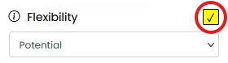
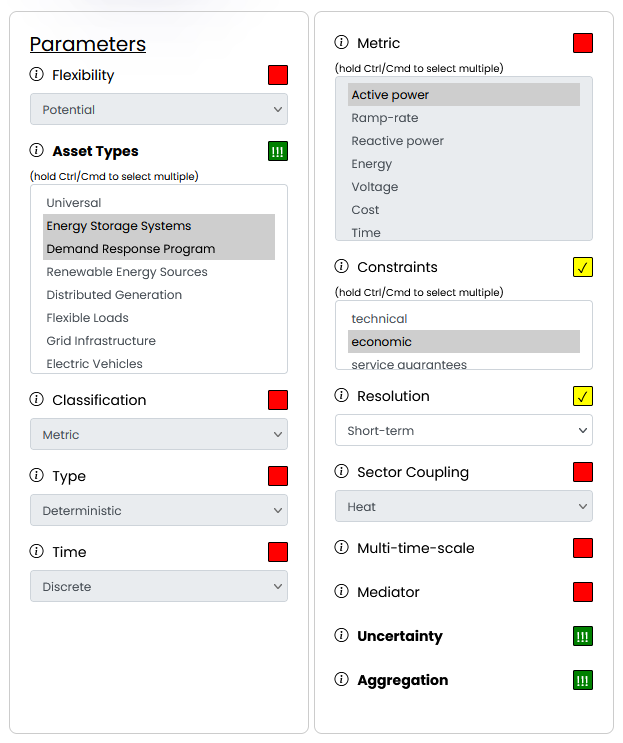

# Using the Flexibility Model Recommender: A Step-by-Step Guide
To demonstrate how to use the **[Flexibility Model Recommender](https://flexibility.offis.de/)**, we will walk through a sample scenario step by step. This example illustrates the selection process and filtering workflow, making it easier to understand how the tool helps identify suitable flexibility models based on specific needs.

## Example scenario
A **Virtual Power Plant (VPP)** aggregates multiple small-scale flexibility resources (such as residential batteries and industrial demand response participants) to enhance grid stability while managing uncertainties in renewable energy generation.

## Step 1: Exploring Parameter Options
Before selecting parameters, we familiarize ourselves with the available choices:

- The [Parameter Explanation article on the Help page](https://flexibility.offis.de/help.php#help-parameters) provides an overview.
- Alternatively, clicking the information icon next to each parameter within the Flexibility Model Recommender opens a popover with a description.

## Step 2: Selecting Parameters for the Scenario
Next, we navigate to the [Flexibility Model Recommender](https://flexibility.offis.de/recommender.php) and define our selection:

Using the **three-way checkboxes** next to each parameter, we categorize them as mandatory, desired, or irrelevant for our VPP scenario.

### Mandatory Parameters (Strictly Required)
1. **Demand Response Programs** (Asset Type) → The VPP includes demand-side participants that adjust consumption based on market signals.
2. **Energy Storage Systems** (Asset Type) → Distributed batteries are used to store excess energy and discharge it when needed.
3. **Uncertainty** → The VPP must handle fluctuations in renewable generation and demand variations.
4. **Aggregation** → The model must support grouping multiple smaller flexibility resources into a unified entity.

### Desired Parameters (Preferred but not mandatory)
5. **Short-term Resolution** → The VPP operates in real-time and short time frames, so models with short-term decision-making are beneficial.
6. **Economic Constraints** → The VPP aims to optimize financial outcomes but does not make it an absolute requirement.

### Irrelevant Parameters (Not considered)
- **Other parameters** are not relevant to this example.

At this point, the parameter selection should match the intended scenario.

## Step 3: Adjusting Match Requirements
We now define the **minimum number of desired parameters** a flexibility model must meet.

- In this example, we set the value to 1, meaning at least one of our desired parameters must be present.
- Setting this value to 2 would require both desired parameters to be included, effectively making them mandatory.

## Step 4: Retrieving Matching Models
Finally, we click the **"Show Models" button**, and the recommender generates a list of flexibility models that best match our selected parameters, displaying the most relevant options first.

Clicking on any model in the results expands it to reveal more details.

**Example of a possible result:**

## Conclusion
By following this process, you can efficiently use the Flexibility Model Recommender to identify models that best suit your specific needs, ensuring a streamlined selection process for various flexibility scenarios.

For a comprehensive overview of all available models and their details, navigate to the [Models tab](https://flexibility.offis.de/models.php).

